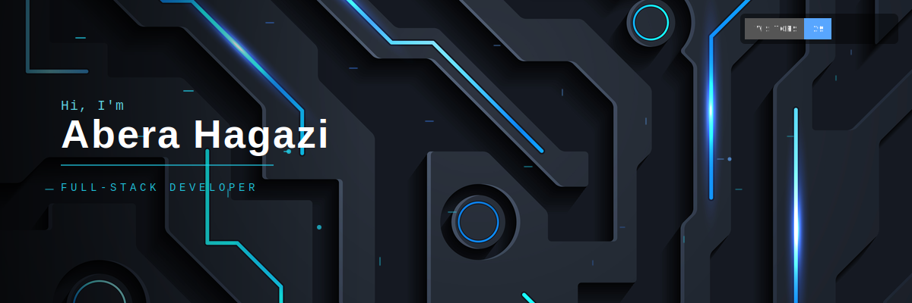

<table>
<tr>
<td><h2>🧑‍💻 About Me</h2></td>
<td align="right"></td>
</tr>
</table>

```yaml
name: Abera Hagazi
role: Full-Stack Developer
focus: 🛒 High-Performance E-Commerce & Web Applications
mission: Building secure, scalable, and blazing-fast web experiences
currently: Shipping pixel-perfect UI backed by rock-solid APIs
fun_fact: I debug with console.log() and I'm not ashamed 😅
```

- 🚀 I build **secure, scalable, and efficient** web apps that don't just work — they *fly*.
- 🛍️ Specialized in **e-commerce platforms** — cart flows, payments, performance, the whole deal.
- 🎯 Obsessed with **UX, performance & security** in equal measure.
- 🌱 Constantly leveling up — new frameworks, new patterns, new problems to solve.
- ⚡ Fun fact: I think in components and dream in JSON.


## 🛠️ Tech Stack

<div align="center">

**Languages**


**Frontend**


**Backend**


**Databases**


**Tools & DevOps**


</div>


## 📊 GitHub Stats

<div align="center">
  
  
</div>

<div align="center">
  
</div>


## 📈 Contribution Snake

<div align="center">
  
</div>

> ℹ️ To activate the snake animation on your own profile, add the [`platane/snk`](https://github.com/Platane/snk) GitHub Action to a workflow in your `ab-pro-dev/ab-pro-dev` repo — it generates this SVG automatically on a schedule.


## 🔭 Currently Working On / Learning

<table>
<tr>
<td valign="top" width="50%">

### 🚧 Currently Building
- 🛒 A high-performance **e-commerce storefront** with Next.js + Stripe
- 🔐 Hardening auth flows with JWT & rate-limiting best practices
- ⚡ Optimizing Core Web Vitals across client projects

</td>
<td valign="top" width="50%">

### 📚 Currently Learning
- 🧠 System design for large-scale e-commerce architecture
- ☁️ Cloud-native deployment patterns (Docker → CI/CD)
- 🧪 Advanced testing strategies (unit, integration, e2e)

</td>
</tr>
</table>


## 🚀 Featured Projects

<table>
<tr>
<td width="50%">

### 🛍️ [E-Commerce Platform](https://github.com/ab-pro-dev/your-ecommerce-repo)
Full-stack storefront with cart, checkout, and admin dashboard — built for speed and scale.

`React` `Next.js` `Node.js` `Express.js` `MongoDB` `Tailwind CSS`

</td>
<td width="50%">

### ⚡ [Performance Dashboard](https://github.com/ab-pro-dev/your-dashboard-repo)
Real-time analytics dashboard tracking site performance & user behavior.

`React` `Node.js` `PostgreSQL` `Chart.js`

</td>
</tr>
<tr>
<td width="50%">

### 🔐 [Secure Auth API](https://github.com/ab-pro-dev/your-auth-repo)
Production-ready authentication service with JWT, refresh tokens, and RBAC.

`Node.js` `Express.js` `MongoDB` `JWT`

</td>
<td width="50%">

### 🎨 [Portfolio & UI Kit](https://github.com/ab-pro-dev/your-portfolio-repo)
Personal portfolio and reusable component library built with a design-system mindset.

`React` `Tailwind CSS` `Next.js`

</td>
</tr>
</table>

<div align="center">

*💡 Replace these with your real repos — pin your best 4-6 on your GitHub profile for extra visibility!*

</div>


## 🤝 Connect With Me

<div align="center">

[](https://linkedin.com/in/YOUR-LINKEDIN)
[](https://x.com/YOUR-TWITTER)
[](mailto:your.email@example.com)
[](https://your-portfolio-site.com)

</div>


<div align="center">

**⭐️ Thanks for stopping by — if something here caught your eye, drop a star on a repo!**

</div>
